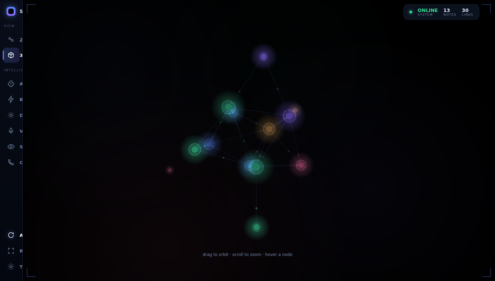
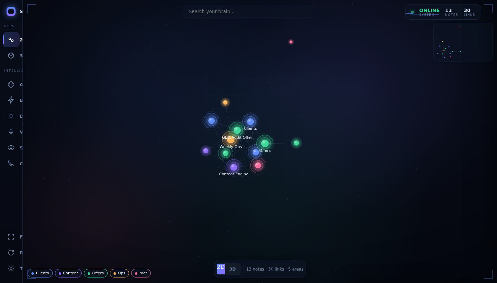
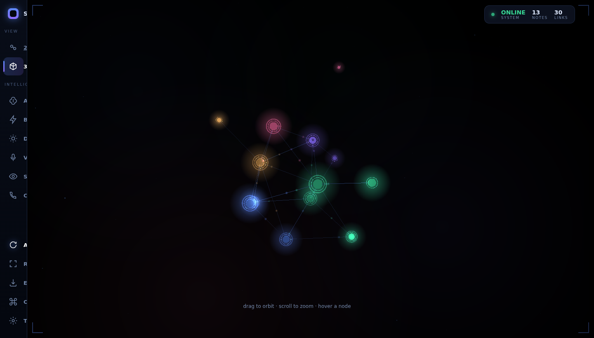
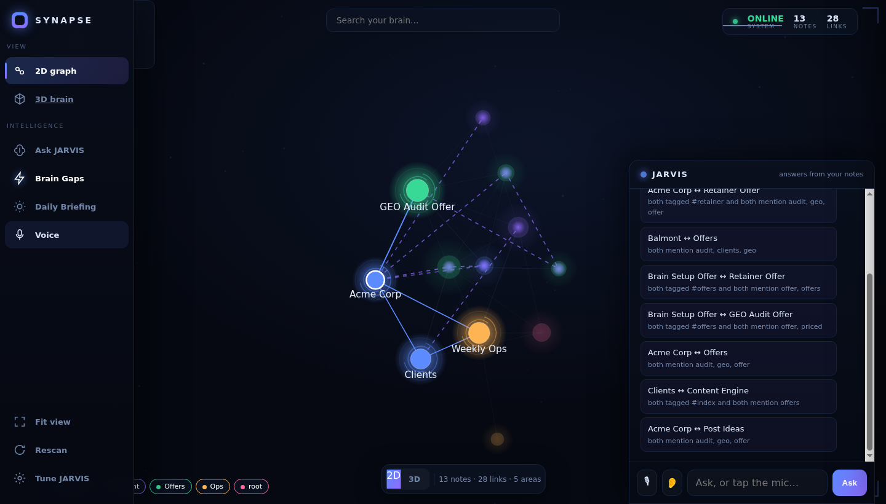
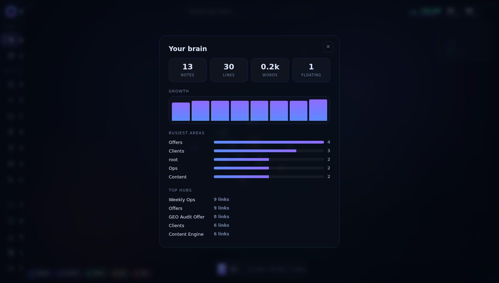
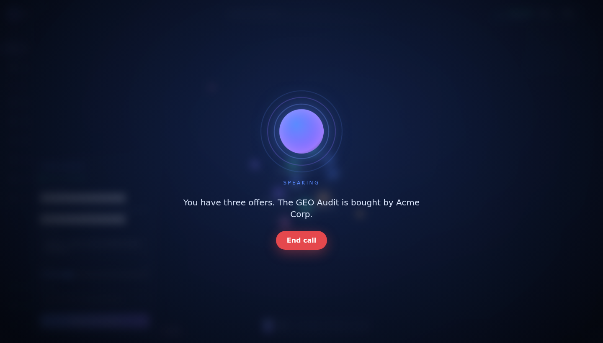
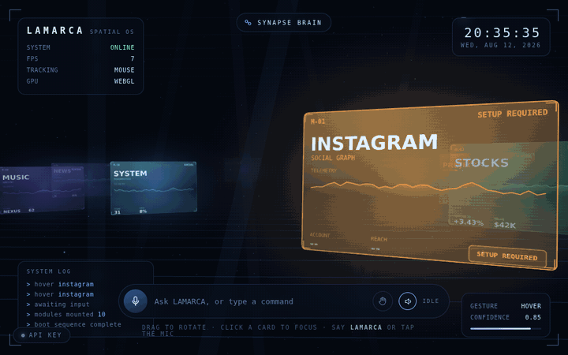
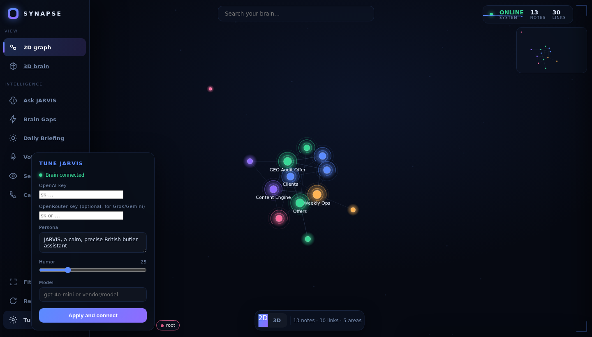

# SYNAPSE

**Your notes, alive.** Point SYNAPSE at a folder of markdown notes and it becomes a living brain you can fly through, in 2D and 3D, with a built in JARVIS that answers from your own notes.

Every note is a node. Every `[[link]]` is a synapse. No database, no build step, no dependencies beyond Python 3. Nothing leaves your machine.

<p align="center">
  
</p>

<p align="center">
  <a href="https://synapse.jonathanlamarca.fr"><b>Try the live demo →</b></a>
  &nbsp;·&nbsp;
  <a href="https://github.com/bruceleeFR/synapse/releases/latest">Download for Windows, macOS, Linux</a>
  &nbsp;·&nbsp; MIT licensed &nbsp;·&nbsp; 100% local
</p>

<p align="center"><sub>The demo runs on a sample brain. Download it to point SYNAPSE at <b>your own</b> notes, with full voice JARVIS, private and offline.</sub></p>

---

## Why people use it

- **See the shape of what you know.** Your notes stop being a flat list and become a map you can actually read.
- **Find what you forgot to connect.** Brain Gaps surfaces the links your notes are missing and writes them in with one tap.
- **Ask your own brain.** JARVIS answers from your notes, flies the graph to the source, and reads it back to you, by text or live voice.
- **It adapts to you.** Capture a thought and it files itself. A daily focus is built from your own notes. The nodes you open most glow brightest.
- **Own it.** Pure local. One Python file, no cloud, no account.

## See it

**A 2D brain, force directed, with a JARVIS panel.**


**The same brain in 3D, with real bloom and named nodes. Click any node to read it.**


**Brain Gaps draws the links your notes are missing, with the reason, ready to apply.**


**Personal analytics: growth, busiest areas, top hubs.**


**Call JARVIS. A live voice conversation with your own notes.**


## LAMARCA OS, step inside your brain

SYNAPSE has a second face: a full screen spatial interface you drive with your voice and your hands. Open it from the rail, one tap to switch back to the brain.

<p align="center">
  
</p>

- A floating carousel of living HUD panels, each in its own color: **Weather** and **News** pull real data with no key, **AI** reads your actual brain (notes, links, top hubs you can jump to), the rest show live telemetry.
- **Talk to it.** Ask anything in the bar or with your voice and it answers out loud, from your own notes.
- **Control it with your hands.** Turn on the camera and a blue mesh tracks your hand: open palm to orbit, pinch to open a panel, two hands to zoom, fist to release. Works on phone and desktop.
- The same hand control also drives the 3D brain: open palm to orbit the galaxy, pinch to open the node under your finger.

**Build your own.** Download the [LAMARCA OS build prompt](docs/lamarca-os-prompt.md), paste it into your AI (Claude or GPT), and it constructs the whole spatial interface as a single file that runs on your machine. See it [live](https://synapse.jonathanlamarca.fr/nexus.html) first for inspiration.

## Quick start

You need Python 3. That is the only requirement.

```bash
python3 synapse.py /path/to/your/notes
```

Your browser opens on the graph. An Obsidian vault works as is, since it is already markdown with `[[wikilinks]]`. No path given runs a small demo vault so you can look around first.

Prefer a double click app with no Python needed? Grab a build from the [latest release](https://github.com/bruceleeFR/synapse/releases/latest).

## What it does

**Explore**
- 2D force directed graph with search, folder filters, backlinks, minimap
- 3D galaxy of your notes with real bloom, synapses firing, and always on labels
- Click any node to read the note with its links out and backlinks
- Command palette on `Cmd` or `Ctrl` + `K` for every action and to jump to any note
- Deep links: every note has a shareable `#note=` URL

**JARVIS**
- Answers from your notes, cites the sources, flies the graph to them and lights them up
- Live voice call, push to talk, and hands free
- Learns you over time and writes what it learns to a local memory file
- Live web research with a source card
- Swap the model by voice: try Grok, GPT, Haiku, Gemini, back to usual

**It adapts to you**
- **Quick Capture**: dump a thought, it gets filed, tagged and linked for you
- **Today's Focus**: a plan for the day, read from your own tasks and notes
- **Brain Gaps**: missing links found, explained, and applied in one tap
- **Rediscover**: resurfaces an old note tied to what you are doing now
- **Guided tour** of your own brain, and **Brain Stats** for the numbers
- Drop an image or a note to capture it (multimodal)
- Reminders, tasks from your checkboxes, screen vision

**Yours**
- Full white label with a tiny `config.json`
- Runs on any vault size, adapts quality for large brains
- Respects reduced motion, light and dark

## Turn on JARVIS

The graph and every effect work with no key. To let JARVIS answer, open **Tune JARVIS** in the app and paste an OpenAI key, or an OpenRouter key for Grok, Gemini and others.

<p align="center"></p>

The key is stored locally in your vault `config.json` and never leaves your machine. Only the notes relevant to your question are sent, and only when you ask.

## White label it

Drop a `config.json` in your notes folder:

```json
{ "name": "MY BRAIN", "accent": "#5b8bff", "accent2": "#8f6bff" }
```

The brand mark, the accents and the whole look follow.

### All config options

```json
{
  "name": "SYNAPSE",
  "accent": "#5b8bff",
  "accent2": "#8f6bff",
  "ai_key": "sk-...",
  "openrouter_key": "sk-or-...",
  "persona": "JARVIS, a calm British butler",
  "humor": 25,
  "voice": "George",
  "strict": false,
  "allow_os": false,
  "realtime": false,
  "hue_bridge": "",
  "hue_user": "",
  "hue_lights": []
}
```

- **strict**: JARVIS only acts when you say his name.
- **allow_os**: lets JARVIS control your machine by voice (volume, dark mode, open apps, find files, tidy Downloads with a plan first). Off by default. Turn it on only on your own machine, never on a public server.
- **realtime**: use the OpenAI Realtime voice engine for the call, instead of the browser voice.
- **hue_bridge / hue_user**: your Philips Hue bridge IP and API user. The room pulses while JARVIS speaks.

## Make it a desktop app

Build a single double click app with no Python needed on the target machine:

```bash
bash build/unix.sh        # macOS or Linux
build\windows.bat         # Windows
```

Or push the repo and let GitHub Actions build Windows, macOS and Linux for you. See `build/README.md`.

## Privacy

SYNAPSE reads your files, builds the graph in memory and serves it to your own browser on localhost. There is no telemetry and no account. When you add an AI key, only the notes relevant to your question are sent to that provider, and only when you ask. Your key lives in your browser and is sent with a request only when you ask, never written to the server.

## Activation and updates

The community build asks for a license key on first launch. Get one by DMing Jonathan on [Skool](https://www.skool.com/house-of-lamarca-), then activate in the browser gate or from the terminal:

```
python3 synapse.py --activate LAMARCA-XXXXXX
```

Until it is activated the app stays locked. Updates are pulled from the live server when a newer version is published: hit **Update** in the app, or `POST /api/update`. The public demo needs no key.

## License

MIT.
